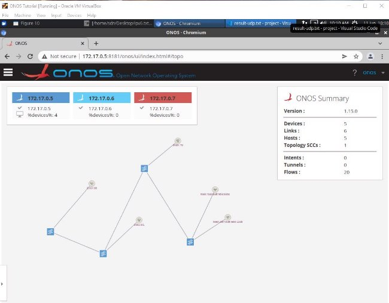
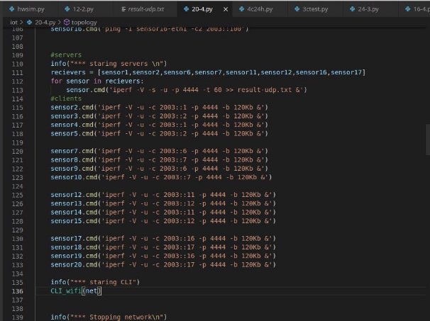
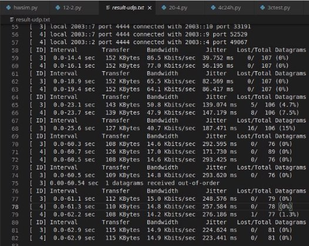
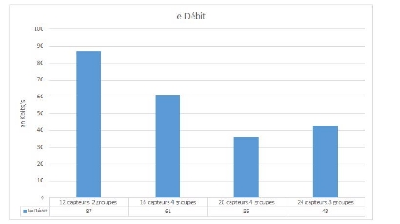
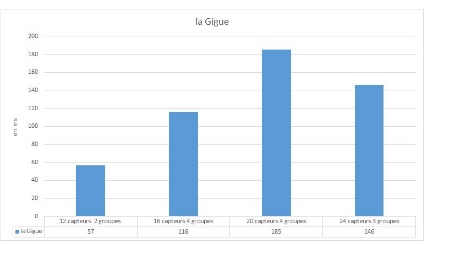
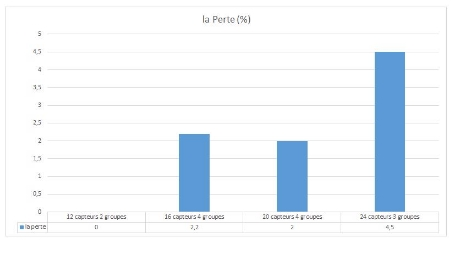
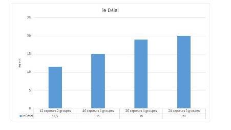

Chapitre3

Conception d un RØseau IoT BasØ sur SDN

1. Introduction

An de mettre en oeuvre notre conception , nous avons dØdiØ ce chapitre aux details de l Øvaluation des performances d un rØseau IoT basØ sur SDN. Nous commen ons par prØsenter les outils qu on va utiliser pour atteindre l objectif de ce project, puis nous prØsentons la topo- logie de reseau et le processus de sa crØation. Nous terminons ce chapitre par une analyse des rØsultats en se basant sur diØrentes ParamŁtres de QoS comme le dØbit, la gigue, le dØlai et la perte des paquets.

2. Le Controleur ONOS :
1. Aper u sur ONOS :

ONOS (open network operating system) reprØsente le plan de contr le dans le SDN, assure

la gestion des Øquipements rØseau (ex : switches) et les liens qui les relie, et aussi l exØcution des programmes ou des modules pour fournir les services de communication entre les nİuds et les rØseaux adjacentes. ONOS ore plusieurs fonctionnalitØs : des APIs et abstraction, ligne de commande CLI et une interface graphique GUI, allocation des ressources et permissions.

ONOS peut tre exØcutØ comme un system de distribution sur plusieurs serveurs, ce qui permet d utiliser les ressources de CPU et de la mØmoire des serveurs et permet aussi la tolØrance contre la panne de serveur.

Le kernel d ONOS et les services core, et les application sont programme en JAVA sous forme

CHAPITRE 3~~ ;A< Le Controleur ONOS :

de bundles qui sont chargØs dans le conteneur Karaf OSGi. OSGi est un systŁme de composants pour Java qui permet d installer et d exØcuter des modules de maniŁre dynamique dans une seule JVM (JAVA Virtual Machine) [9].

2. L Architecture d ONOS

L architecture d ONOS est composØe de 4 ØlØments principaux [10] :

Le Noyau DistribuØ

Fournit l ØvolutivitØ, la disponibilite, les performances, onos est deploye sous forme d un service sur un group de serveur. Et le meme software execute dans chaque serveur. Ce qui permet d assurer la disponibilite en cas d une panne d un des serveurs. Les instance d ONOS fonctionnent ensemble pour crØer ce qui appara t au reste du rØseau comme une plate-forme unique.

Figure 3.1  Le Noyau DistribuØ.

Abstraction Northbound/API

Il existe deux abstractions northbound : le Framework d intention et la vue de rØseau :

Le Framework d intention permet  une application de demander un service du rØseau sans

avoir de connaitre les dØtails de service. Cela permet aux operateurs rØseau et les dØveloppeurs

CHAPITRE 3~~ ;A< ![ref1] Mininet-IoT

d applications de programmer le rØseau a un niveau ØlevØ.

La vue globale du rØseau fournit une vue des hosts, switches,liens.une.

Les Abstractions Southbound

Active les protocoles de niveau bas pour Contr ler les Øquipements OpneFlow. L abstraction southbound isole le contr leur d ONOS des dØtails des couches inferieurs.

La ModularitØ des Softwares

La construction des logiciels est importante, le logiciel doit tre facile  amØliorer, modier et maintenir. L Øquipe ONOS a mis grandsoin dans la modularitØ pour faciliter les dØveloppeurs   travailler avec le logiciel.

Figure 3.2  Les Couches d ONOS.

3. Mininet-IoT
1. Aper u sur Mininet

Mininet est un Ømulateur rØseau qui permet de crØer des topologies rØseau vitruele en utilisant les diØrents neuds (switches, controleur, hosts) et des liens qui les relies, les switches de mininet supportent OpenFlow pour performer le routage dans le reseau SDN.

AprŁs l installation de mininet nous pouvons tester une topologie de 2 hosts, 1 switch et 1

CHAPITRE 3~~ ;A< ![ref1] Iperf

cont rleur en exØcutant "> sudo mn" [11].

Figure 3.3  Mininet.

[11]

2. Mininet-IoT

Minininet-IoT est une extention du codeBase de mininet qui fournir les outils neccessaires pour crØer et dØvelopper des rØseau IoT. Mininet permet de :

`  `Fournir une expØrience d essai simple pour dØvelopper des applications OpenFlow.

`  `Inclure une linge de commande pour consulter et debugger les diØrents noeuds de rØseau.

`  `Pr t pour l utiliser sans programmation, mais dans le cas invers vous pouvez aller plus

loin avec PYTHON API.

`  `Tester des topologies complexes en utilisant l environnement vituelle.

Sur mininet chaque host a un terminal linux, donc vous pouvez exØcuter des commandes linux sur les diØrents hosts.

Comme il est mentionnØ au-dessus, Il est possible d utiliser Mininet directement via l outil en ligne de commande pour crØer les diØrents topologies SDN. Exemple : la commande suivante permet de crØer un switch connectØ  3 hosts(PC) et  un contr leur bien dØnie.

\> sudo mn - -topo single,3 - -controller remote,ip=172.0.0.1 :6653

Ou bien on peut utiliser le PYTHON API, pour programer notre propre rØseau.

3. Python API

Dans cette imlpØmentation on va utiliser PYTHON pour crØer notre propre topologies avec la librairie fournit par python API. Mininet prend en charge les topologies paramØtrØes. Avec quelques lignes de code Python, vous pouvez crØer une topologie exible qui peut tre congurØe en fonction des paramŁtres que vous lui transmettez et rØutilisez pour plusieurs expØriences.

Remarque : mininet IoT nØcessite un kernel 4.18 ou plus.

4. Iperf

Iperf est un outil pour mesurer la bande passante et la qualitØ d un lien rØseau. Le lien dernier est dØlimitØ par deux machines sur lesquelles est installØ Iperf. Les performances d un lien peuvent tre ØvaluØes comme suit [12] :

`  `Le DØlai : peut tre mesurØe par la commande de Ping.

`  `La Gigue (variation de la dØlai) : par un test Iperf UDP.

24
CHAPITRE 3~~ ;A< La RØalisation de la Topologie

`  `Perte de paquet : mesurØe avec un test Iperf UDP.

`  `Le DØbit et Bande passante : peut tre mesurØ par iperf TCP ou UDP aprŁs avoir spØciØ

la bande passante.

`  `tester des topologies complexes en utilisant l environnement vituelle.

5. La RØalisation de la Topologie
1. Aper u

Dans cette topologie illustrØe dans la gure 3.4 on a 4 groupes chaque groupe contient des capteurs qui forment un rØseau maillØ et s Øchangent des donnØes via le protocole 6LOWPAN, tels que le capture qui est connectØ avec le switch via Ethernet (lien laire) reprØsente le capteur Edge qui permet de relier rØseau des capteurs avec le rØseau laire. dans ce test il n y aura pas de traitement des donnØes (data processing). Mais gØnØralement le capture Edge qui re oit les donnØes faire le traitement avant l envoi au serveur, ou on peut utiliser un serveur de computing qui va faire le traitement et le sauvegarde des donnØes.

Et avec le l application IPv6 rØactive forwarding dØj  installØ sur ONOS les paquets IPv6 des captures destinØs au serveur seront routØ.

Figure 3.4  La Topologie ProposØe.

2. RØalisation

On dØmarre le contr leur et on entre dans linge de commande d ONOS (ONOS CLI), puis on active l application de rØactive forwarding. par la command app activate fwd .

AprŁs , il faut activer les fonctionnalitØ de IPV6 pour le routage des paquets IPV6. Pour cela on exØcute les 2 command suivantes :

Figure 3.5  Description.

"cfg set org.onosproject.fwd.ReactiveForwarding ipv6Forwarding true" "cfg set org.onosproject.fwd.ReactiveForwarding matchIpv6Adress true"

Figure 3.6  La ligne de command d ONOS.

AprŁs avoir prØparØ le contr leur, on exØcute le script Python qui permet de crØer la topologie sous de mininet-iot. Dans la n d exØcution nous consultons l interface graphique d ONOS comme il est montrØ dans la gure 3.7, et voyons les switches OVS (Open V Switch) connectØ au contr leur les capteurs Edge et au serveur, Le deuxiŁme l h te connectØ au switch 1 est le serveur. On ne voit pas les autre capteur paracerque il ne pas connecte directement au switch.

Pour l Øvaluation des performances, on a pris 4 scØnarios de test, celui qui est dans tolopogie de la gure 3.4, les 3 qui restent sont prØsentØs dans la gure 3.9.

Notez bien qu  nous avons besoin de faire un ping entre les capteurs et le serveur pour qu  ils soient dØtectØ par le contr leur, comme il est montrØ dans la gure 3.8.

27

CHAPITRE 3~~ ;A< La QualitØ de Service

Figure 3.7  l Interface Graphique d ONOS.

6. La QualitØ de Service

La QoS (QualitØ de Service) reprØsente la capacitØ d un rØseau  gØrer la transmission de donnØes de diØrents ux avec les spØcications requises des paramŁtres QoS. On peut Øvaluer la qualitØ de service avec ces paramŁtres :

`  `La Perte de Paquets : reprØsente le pourcentage des paquets qui n arrive pas  la

destination  cause de congestions de rØseau qui mŁne  la suppression des paquets. La perte doit tre le plus minimal possible.

`  `Le DØlai : est le temps nØcessaire pour qu un message arrive  la destination. Plus il est

proche  zØro plus la QOS est meilleur.

`  `La Gigue : reprØsente la variation de dØlai, elle est causØ par la congestion de rØseau,il

doit s approcher  zØro .

`  `La Bande Passante : est la quantitØ d information maximale que le lien peut supporter

dans une pØriode de temps.

Le tableau 3.1 montre les normes Tiphon utilisØes dans l analyse processus. Le dØbit mesurØ

28
CHAPITRE 3~~ ;A< Evaluation des performances

Figure 3.8  Ping.

Figure 3.9  Les Diirents ScØnarios TestØs.

est basØ sur le nombre total d arrivØes de paquets rØussies observØ  destination pendant un intervalle de temps spØcique divisØ par la durØe de cet intervalle de temp [13].

7. Evaluation des performances

comme le montre la gure 3.10, pour que les capteurs qui re oivent des donnØes, nous devons les dØnir comme serveurs dans iperf en utilisant l option -s. On utilise le protocole UDP pour ces tests, -u signie UDP , -V est pour IPV6 et -p est pour spØcier le numØro de port, -t est juste pour le temps, ce qui signie que le test ne doit pas dØpasser 60 secondes.

pour les capteurs qui envoient, nous devons les dØnir en tant que clients dans iperf, nous faisons a par spØcier l adresse IP du destinataire dans l option -c comme indiquØ sur la gure 3.10, la bande passante peut tre spØciØe avec -b, comme vous pouvez le voir qe elle est dØni sur 120Kbits/s, et les rØsultats seront de chaque connexion seront sauvegarder dans le chier

Table 3.1  Mesure de la QoS [13].

|Remarque|Index|DØlai (ms)|Gigue (ms)|Perte (%)|DØbit (%)|
| - | - | - | - | - | - |
|TrØs Bien|4|150 <|0|0|100|
|Bien|3|150-300|0-75|3-15|75|
|Moyen|2|300-450|75-125|15-25|50|
|Mauvais|1|> 450|> 125|25-100|< 25|

result-udp.txt.

nous pouvons voir les rØsultats de dØbit,de la gigue et de la perte des paquets dans la gure 3.11, le dØlai peut tre calculer par la command de ping. on refaire le test plusieurs fois et on prend la moyenne. le scØnario de test utilisØ est RRUL (Realtime Response Under Load). Ce type de test simule une rØseau dans les pires conditions en mettant une charge sur le rØseau puis faire la rØcupØration des donnØes. on refaire la meme processus avec d autre scenario de test dans la gures 3.9, les rØsultats sont prØsentØs dans les gures 3.12, 3.13, ??, 3.15.

Figure 3.10  Tests d Iperf.

Le DØbit

la gure 3.12 montre les les rØsultats de dØbit, Pour les 4 tests on a attribuØ 120KB/s de bande passante et nous avons obtenu un dØbit de 81Kbit/s (68%) et 63Kbit/s (50 %) respectivement. Et pour les 2 autre 65Kbit/s de bande passante et nous avons obtenu un dØbit de 45Kbits/s (30 %) et 46Kbits/s (36%), alors le dØbit tombe dans les catØgories de moyen et bien.

Figure 3.11  Les RØsultats de Test.

Figure 3.12  Le DØbit.

3\.7.1 La Gigue

la gure 3.13 montre les les rØsultats de la gigue, nous remarquons une relation de corrØlation directe entre le nombre de captures et la gigue, Nous avons obtenu 57ms, 63ms, 185ms et 146ms pour les 4 scØnarios. Des performances bonnes et moyennes pour 12 capteurs 2 groupes et 16 capteurs 4 groupes respectivement. De mauvaises performances pour les 24 capteurs 3 groupes

et 20 capteurs 4 groupes. Les tests de gigue tombent dans les catØgories de bonne et moyenne.

Figure 3.13  La Gigue.

La Perte

dans la gure 3.14 nous remarquons que la perte augmente en fonction de nombre des capteurs, 0% pour le test de 12 capteurs ce qui est trŁs bien, Et 2%, 2.2% et 4.5% pour les autres ce qui est bien.

Figure 3.14  La Perte.

Le dØlai

la gure 3.15 montre les les rØsultats de la dØlai, nous remarquons Encore une relation de corrØlation directe entre le nombre de capture et le dØlai, On a obtenu 11.5ms, 15ms, 19ms et 20ms pour les 4 scØnario. Les tests de gigue tombent dans la catØgories de bien.

32

CHAPITRE 3~~ ;A< ![ref1] Conclusion

Figure 3.15  Le DØlai

Performances d Ethernet (laire)

Les performances en rØseau laire sont trŁs bien et similaire dans tous les scØnarios.   Le DØbit : 1 Mbit/s.

`  `La Gigue : 0 - 0,04 ms.

`  `La Perte : 0 %.

`  `Le DØlai : 0 - 35 ms.

8. Conclusion

Sur la base des rØsultats des valeurs de dØbit, dØlai, gigue et de perte de paquets on peut dire que les performances de rØseau 6Lowpan sont moyen-bien avec les meilleur rØsultats dans le cas de 2 groupes 12 captures. nous avons dØduit que Plus le nombre de capture est ØlevØ plus les performances baissent, les 2 derniers tests 3 groupes, 24 captures et 4 groupes, 20 captures ont donnØ de mauvaises performances de la gigue, Ce qui n est pas bien pour les applications en temps rØel comme la VoIP (Voice over Internet Protocol) par exemple en cas d un grand rØseau qui contient beaucoup de capteurs.
33

[ref1]: Aspose.Words.1a066a4e-a947-44e2-822b-6f812d8006c2.002.png
